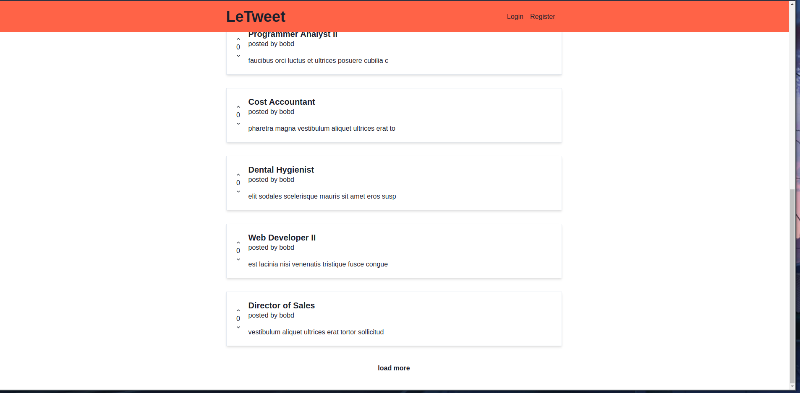

<!-- PROJECT LOGO -->
<br />
<p align="center">

  <h3 align="center">Social Media Clone</h3>

  <p align="center">
    SNS app to share information!
    <br />
  </p>
</p>

<!-- TABLE OF CONTENTS -->
<details open="open">
  <summary>Table of Contents</summary>
  <ol>
    <li>
      <a href="#about-the-project">About The Project</a>
      <ul>
        <li><a href="#built-with">Built With</a></li>
      </ul>
    </li>
    <li>
      <a href="#getting-started">Getting Started</a>
      <ul>
        <li><a href="#prerequisites">Prerequisites</a></li>
        <li><a href="#installation">Installation</a></li>
      </ul>
    </li>
    <li><a href="#usage">Usage</a></li>
  </ol>
</details>

<!-- ABOUT THE PROJECT -->

## About The Project

<!-- [![Product Name Screen Shot][product-screenshot]](images/screenshot.png) -->

  <a href="#">
    
  </a>

SNS to allow users to share information.

### Built With

- [Typescript](https://typescriptlang.org)
- [NextJS](https://nextjs.org)
- [NodeJS](https://nodejs.org)
- [Docker](https://docker.com)
- [Graphql](https://graphql.org)

<!-- GETTING STARTED -->

## Getting Started

### Prerequisites

- NodeJs

- TypeScript

- Docker

### Installation

1. Install Prerequisites
2. run backend
   ```sh
   cd backend
   npm run watch
   npm run dev
   ```
3. Run FrontEnd locally.
   ```sh
   cd frontend
   npm run dev
   ```

<!-- USAGE EXAMPLES -->

## Usage

Use this space to show useful examples of how a project can be used. Additional screenshots, code examples and demos work well in this space. You may also link to more resources.

_For more examples, please refer to the [Documentation](https://example.com)_

<!-- ROADMAP -->

## Roadmap

See the [open issues](https://github.com/othneildrew/Best-README-Template/issues) for a list of proposed features (and known issues).

<!-- CONTRIBUTING -->

## Contributing

Contributions are what make the open source community such an amazing place to be learn, inspire, and create. Any contributions you make are **greatly appreciated**.

1. Fork the Project
2. Create your Feature Branch (`git checkout -b feature/AmazingFeature`)
3. Commit your Changes (`git commit -m 'Add some AmazingFeature'`)
4. Push to the Branch (`git push origin feature/AmazingFeature`)
5. Open a Pull Request

<!-- LICENSE -->

## License

Distributed under the MIT License. See `LICENSE` for more information.
